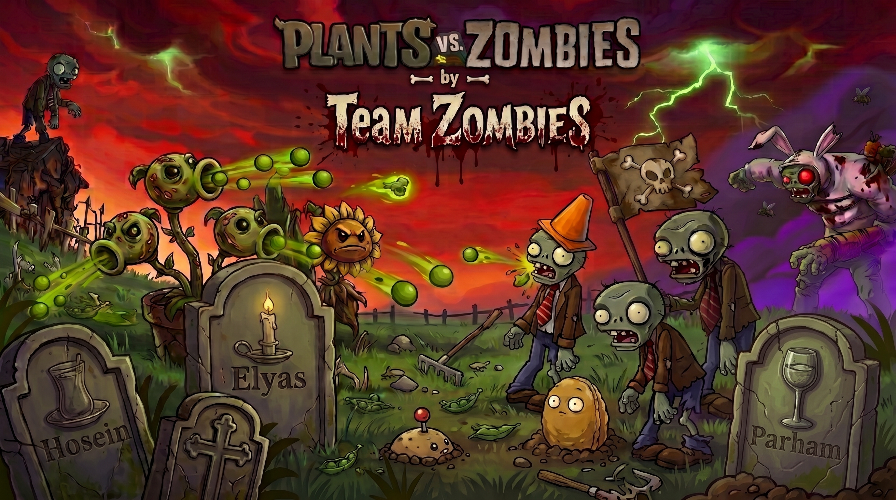

<div align="center">
  
</div>

# 🌻 Plants vs. Zombies 2 — Java / libGDX Edition 🧟

<div align="center">


</div>

<br/>

> A full, network-enabled re-creation of **Plants vs. Zombies 2**, built from scratch in Java on top of libGDX for the *Advanced Programming* course at **Sharif University of Technology**.
> ~46,000 lines of Java across 453 files, covering a complete adventure mode, a custom entity/behavior engine, and a hand-rolled client-server multiplayer layer.

---

## 📖 Table of Contents

- [Overview](#-overview)
- [Highlights](#-highlights)
- [Architecture](#-architecture)
- [The Multiplayer Layer](#-the-multiplayer-layer)
- [Gameplay Systems](#-gameplay-systems)
- [Design Patterns](#-design-patterns-in-the-wild)
- [Project Structure](#-project-structure)
- [Tech Stack](#-tech-stack)
- [Getting Started](#-getting-started)
- [Testing](#-testing)
- [Project Scale](#-project-scale)
- [Contributors](#-contributors)

---

## 🌟 Overview

The player defends the last line of human defense against relentless waves of zombies using an arsenal of unique plants, each with its own attack pattern, upgrade path, and Plant Food ability — faithfully modeled after **Plants vs. Zombies 2**. Beyond the single-player adventure, the game ships with a **fully networked "I, Zombie" mini-game**: two players connect through a dedicated game server, get matched (by username or by a random matchmaking queue), and play out a real-time, state-synchronized 1v1 — one player planting defenses, the other commanding a zombie horde.

This repository represents the third and final phase of the project, where the game evolved from a local, single-player prototype into a **client-server system** with persistent accounts, live matchmaking, real-time state sync, in-match reactions, and a global leaderboard.

---

## ✨ Highlights

- 🌐 **Custom client-server multiplayer** over raw TCP sockets — no external game-networking framework, just a hand-built binary/JSON protocol, a thread-per-connection server, and a client-side reconciliation loop.
- 🧠 **60+ distinct zombies and plants**, each composed from independent `MoveBehavior`, `AttackBehavior`, `DefenseBehavior`, and `Effect` strategies rather than deep inheritance chains.
- 🐉 **Three fully scripted boss fights** (Dragon, Mammoth, Shark, Spider Zombosses) built on an `IZombossAttack` state-machine.
- 🎮 **Local couch co-op mode** for "I, Zombie" — one keyboard, one mouse, two players, zero network required.
-  **Custom Crazy Dave cursor** rendered via a hand-loaded `Pixmap` at startup — a small polish detail that replaces the OS cursor with an in-theme one the moment the game boots.
- 💬 **Live in-match reactions** (quick chat, emojis, animated stickers) broadcast peer-to-peer through the server during a match.
- 🏆 **Server-backed global leaderboard** with per-user high scores that survive logout/login and device changes.
- 🧩 **Season-based adventure mode** (Ancient Egypt, Frostbite Caves, Pirate Seas/Big Wave Beach, Dark Ages) with quests, a Zen Garden greenhouse, a travel log, and daily reset events.
- ✅ Unit-tested controllers, validators, and factories with JUnit.

---

## 🏗 Architecture

The project follows a strict **Model-View-Controller** split, with an additional **`net`** layer bolted on cleanly in the top-level package so the game core stays engine/network agnostic:

```
io.java.pvz
├── controllers/   → Input handling & orchestration (GameController / MenuController)
├── models/        → Game state, entities, rules, persistence — engine-independent
├── net/           → Client & server networking, wire protocol, match engine
├── views/         → libGDX Screens, Scene2D UI, renderers, sound
├── utils/         → Reusable UI widgets & helpers
└── loader/        → Asset loading & JSON-driven data loading (plants/zombies/quests)
```

Game logic never talks to libGDX directly from the model layer, and the network layer is decoupled from rendering — the same `MatchGameEngine` that runs on the server drives the authoritative simulation, while each client only renders the snapshots it receives.

---

## 🌐 The Multiplayer Layer

Phase 3's core deliverable: turning a local, single-device game into a real client-server product.

```
Client A ⇄  ┌────────────────────────┐  ⇄ Client B
            │       GameServer        │
            │  (ServerSocket + thread │
            │      pool per client)   │
            ├──────────────────────────┤
            │  RequestDispatcher       │  → routes NetworkMessage by MessageType
            ├──────────────────────────┤
            │  AuthHandler             │  → login / signup / security questions
            │  MatchmakingHandler      │  → challenge-by-username & random queue
            │  MatchSyncHandler        │  → in-match actions, pause/resume, surrender
            │  ReactionHandler         │  → chat / emoji / sticker broadcast
            │  LeaderboardHandler      │  → score submission & ranking
            ├──────────────────────────┤
            │  MatchGameEngine         │  → authoritative simulation per match
            │  SessionRegistry /       │
            │  MatchRegistry           │  → online users & active matches
            └──────────────────────────┘
```

**How it works, end to end:**

1. **Accounts move to the server.** Sign-up, login, and profile data (coins, gems, progress) are no longer stored on the client — `AuthHandler` validates and persists everything server-side, so logging in from a new device restores the exact same account.
2. **Opponent selection.** Before a match, a player either:
   - **challenges a specific username** — the server checks whether that user is online and pushes a `CHALLENGE_INVITE` pop-up to them, resolved by `CHALLENGE_RESPONSE`; or
   - **joins the random queue** — `RandomMatchQueue` pairs up the first two waiting players automatically.
3. **Real-time sync.** Once matched, `MatchGameEngine` runs the authoritative "I, Zombie" simulation; `MatchStateSnapshotBuilder` serializes lawn state (plants, zombies, projectiles, timers) into `MATCH_STATE_SYNC` messages so both clients always see an identical battlefield, even though only one of them controls the plants and the other controls the zombies.
4. **Live reactions.** During a match, either player can fire off one of 3 quick messages, 3 emojis, or (bonus) 3 animated stickers — the server relays them instantly via `ReactionHandler`, and the opponent's client renders the reaction as an overlay in the corner of the screen.
5. **Leaderboard.** After every match/score run, results are pushed to `LeaderboardHandler`; if a submitted score beats the player's stored best, the server updates it — powering a global, always-current leaderboard instead of a local high-score file.

---

## 🎮 Gameplay Systems

| System | Description |
|---|---|
| **Adventure Mode** | Multi-season campaign (`Adventure` → `Chapter` → `Level`) with normal, boss, bonus, and special levels (conveyor belt, love plants, locked plants, dead-line survival). |
| **I, Zombie Mini-Game** | Playable **online** (networked 1v1, with matchmaking) **or offline** (local couch co-op — mouse for the plant player, keyboard for the zombie player). |
| **Other Mini-Games** | Vase Breaker, Bowling, Beghouled, and Zombotany, each implementing a shared `IMinigame` contract. |
| **Plant/Zombie engine** | Entities are configured from JSON data files at load time and assembled via `PlantFactory` / `ZombieFactory`, with behavior injected as composable strategy objects instead of hardcoded per-type logic. |
| **Zomboss Battles** | 4 unique final bosses, each an `IZombossAttack` state machine cycling through phase-specific attacks (fireballs, freezing wind, missile barrages, shark bites…). |
| **Progression** | Quest system with pluggable win conditions (`IQuestCondition`), reward types (currency, seed packs, unlockables), a Zen Garden greenhouse for growing plants, and a Travel Log. |
| **Economy & Shop** | Coins, gems, a card shop, and an inventory system, all synced to the server-side account. |
| **Global Leaderboard** | Server-ranked scoreboard with a live "My Point" column tied to the networked score-attack mode. |

---

## 🧩 Design Patterns in the Wild

This codebase leans heavily on composition over inheritance to keep 60+ zombie types and dozens of plants maintainable:

- **Factory** — `PlantFactory`, `ZombieFactory`, `LevelFactory`, `MiniGameFactory`, `QuestFactory` centralize construction from data-driven definitions.
- **Strategy** — Combat and movement are fully decomposed: `MoveBehavior`, `AttackBehavior`, `DefenseBehavior`, `PlantFoodStrategy`, `IPlantStrategy`, `IZombossAttack` — each zombie/plant is built by *composing* small, swappable behaviors rather than subclassing a monolithic base class.
- **Observer** — `GameEventMessenger` is a global pub/sub bus (quests, sound, camera shake, score, drops all react to `GameEvent`s without tight coupling).
- **Singleton** — `ScreenManager`, `AssetLoader`, `AudioManager`, `GameEventMessenger` for shared global state.
- **State Machine** — Zomboss fights and network match lifecycle (waiting → in-progress → paused → ended) are modeled explicitly rather than with flag soup.
- **Command-ish dispatch** — the server's `RequestDispatcher` maps every `MessageType` to a handler method reference, keeping `GameServer` itself free of protocol logic.
- **Repository** — `UserRepository` / `JsonRepository` abstract persistence behind a small interface so storage can evolve independently of the domain model.

---

## 📁 Project Structure

```
src/main/java/io/java/pvz/
├── controllers/
│   ├── GameController/       # In-game feature controllers (matchmaking, shop, quests, leaderboard…)
│   └── MenuController/       # Login / signup / profile / main menu controllers
├── models/
│   ├── database/              # UserRepository, JSON-backed persistence
│   ├── entities/
│   │   ├── plants/            # Plant, PlantFactory, upgrade & food strategies
│   │   ├── zombies/            # Zombie, behaviors (move/attack/defense/effect), zomboss/
│   │   └── projectiles/        # Projectile types & impact effects
│   ├── fields/                 # Lawn tiles, modifiers per season, lawn mowers, brains
│   ├── game/                   # Arena, GameSession, win/lose conditions, adventure/, minigame/
│   ├── quest/                  # Quests, conditions, rewards
│   ├── users/                  # Account, wallet, inventory, progress
│   └── validation/              # Input & username/password validation rules
├── net/
│   ├── client/                 # NetworkClient, state syncer, server config
│   ├── protocol/                # NetworkMessage & MessageType wire format
│   └── server/                  # GameServer, dispatcher, registries, handlers/, game/ (MatchGameEngine)
├── views/
│   ├── screens/                 # libGDX Screens (menus, gameflow, chapter/level select…)
│   │   ├── gameflow/            # Battlefield/plant/zombie/effect renderers, HUD, input
│   │   └── modals/               # Pop-ups: matchmaking, leaderboard, pause, shop, dialogue…
│   └── sound/                    # Music/SFX enums
└── utils/                        # Reusable Scene2D widgets (cards, toasts, buttons…)
```

---

## 🛠 Tech Stack

- **Language:** Java 17
- **Game Framework:** [libGDX](https://libgdx.com/) (Scene2D UI, texture/asset pipeline, custom cursor & input handling)
- **Networking:** Raw `java.net` TCP sockets, custom JSON-based wire protocol, `ExecutorService` thread pool for concurrent client handling
- **Persistence:** Jackson-backed JSON repositories for user accounts, progress, and leaderboard data
- **Testing:** JUnit
- **Architecture:** MVC + Strategy/Factory/Observer-heavy domain design

---

## 🚀 Getting Started

### Prerequisites
- JDK 17+
- A libGDX-compatible build setup (Gradle recommended)

### Running the game
```bash
git clone https://github.com/<your-username>/PlantsVsZombies-Java.git
cd PlantsVsZombies-Java
```

1. **Start the server** (from `net.server.ServerMain`), which opens a `ServerSocket` on the configured port and starts accepting client connections.
2. **Launch one or more game clients** — each client points at the server's host/port via `ServerConfig` and connects through `NetworkClient`.
3. Sign up / log in, then head into the **"I, Zombie"** mini-game to challenge a friend by username or jump into the random matchmaking queue — or just play the full adventure mode solo, no server required.

> 💡 Only the multiplayer "I, Zombie" mode and account sync require the server to be running; the rest of the campaign runs fully offline.

---

## ✅ Testing

Unit tests cover controllers, validation logic, and factories:

```bash
./gradlew test
```

Included suites: `LoginMenuControllerUnitTest`, `SignupMenuControllerUnitTest`, `MainMenuControllerUnitTest`, `ProfileMenuControllerUnitTest`, `NavigationControllerUnitTest`, `CollectionControllerUnitTest`, `NewsControllerUnitTest`, `SettingControllerUnitTest`, `DatabaseManageUnitTest`, `UserValidationUnitTest`, `PlantFactoryTest`, `PlantUpgradeTest`.

---

## 📊 Project Scale

| Metric | Count |
|---|---|
| **Total lines (incl. blank lines & comments)** | **~46,250** |
| Java source files | 453 |
| Lines in `main` | ~44,400 |
| Lines in `test` | ~1,850 |
| Distinct zombie behavior classes | 70+ |
| Distinct plant strategy/effect classes | 60+ |

---

## 👥 Contributors


- Elyas Hajinezhad (404105734)
- Hossein Dolati Javan (404105831)
- Parham Hadavi (404106514)

---

<div align="center">
Made with 🌻, 🧟, and way too much coffee.
</div>
